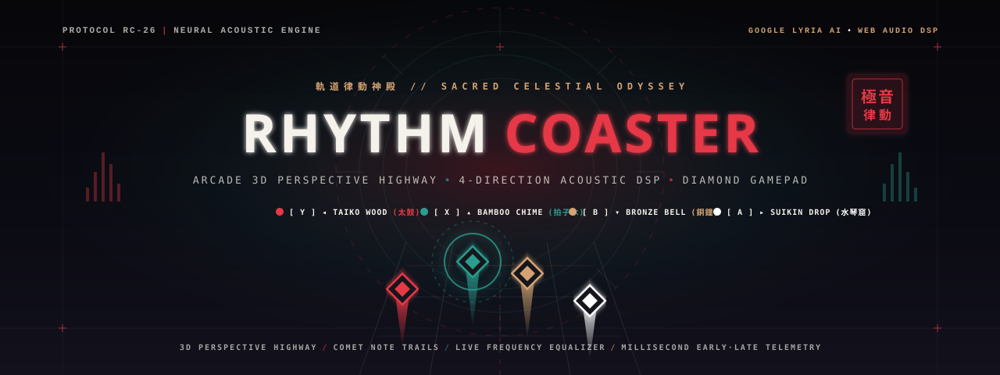

<div align="center">



<br />

[](https://github.com)
[](https://deepmind.google/technologies/lyria/)
[](https://github.com)
[](https://github.com)
[](https://github.com)

<p align="center">
  <b>A high-fidelity rhythm game fusing Japanese Modernist Poster Design, Sacred Celestial Architecture, Real-Time Web Audio DSP Modulation, and Generative Neural Track Composition.</b>
</p>

---

</div>

## ◬ Overview // 概要

**Rhythm Coaster (軌道律動神殿)** reimagines the arcade rhythm experience as an esoteric acoustic temple. Players travel down a 3D perspective kinetic highway, striking radiant diamond notes synchronized to dynamic musical compositions with four organic Japanese acoustic instruments.

Every stage can be **generated from thin air** using Google's Lyria neural model—complete with strict musical movements, energy progression curves, and precision beatmaps—or constructed by **dropping your own audio files** into the in-app analyzer.

```
+-----------------------------------------------------------------------------------+
|  [ ARCHIVE REF: RC-2026 ]                     [ LAT 35°41′N // LONG 139°46′E ]   |
|                                                                                   |
|         極音                                                                      |
|        [ 律動 ]  RHYTHM COASTER                                                   |
|                  NEURAL COMPOSITION FORGE & SACRED KINETIC RAIL                   |
|                                                                                   |
|  [ ◂ LEFT (Y) ]   [ ▴ TOP (X) ]    [ ▾ BOTTOM (B) ]   [ ▸ RIGHT (A) ]             |
|  TAIKO WOOD       BAMBOO CHIME     BRONZE BELL        SUIKIN DROP                 |
|  VERMILION #e639  JADE CYAN #2a9d  SOLAR GOLD #d4a3   BONE WHITE #f5f2            |
+-----------------------------------------------------------------------------------+
```

---

## ✦ Key Features // 特徴

### 1. 3D Perspective Track Highway & Visual Presentation
- **Perspective Track Highway**: The 4 lanes converge towards the celestial horizon with true 3D perspective depth, longitudinal speed tick marks, and lateral neon highway rails.
- **Radiant Comet Energy Trails**: Approaching notes stream luminous, tapered comet tails trailing behind their velocity vector.
- **Proximity Timing Flare**: Notes flare with brilliant neon halos as they enter the final 140px hit window before the target gate.
- **Bilateral Live Audio Equalizer**: Real-time frequency spectrum ribbons flank the left and right margins of the playfield, bouncing to the actual sub-bass, kick, and synths via a Web Audio `AnalyserNode`.
- **Calligraphic Timing Telemetry**: When a note is struck, calligraphic Kanji stamps (`極` Perfect, `優` Great, `良` Good, `逸` Miss) pop with a spring bounce and display **millisecond timing offsets** (e.g. `+14ms EARLY`, `-10ms LATE`, `±2ms PERFECT`).
- **Multi-Tier Overdrive & Combo Fever**: Building streaks triggers dynamic state transitions:
  - `10× Adept (初心)`: Golden combo glow.
  - `25× Master (達人)`: Cinnabar edge aura with fiery ambient embers.
  - `50× Overdrive Max (極限)`: Full celestial astrolabe hyper-space with ×4 score multiplier.
- **Tactile Receptor Gate**: Receptors at the judgment line feature rotating mechanical astrolabe rings and spring physics (compresses to `0.86×` on press and rebounds with a radiant shockwave).
- **Cyber-Japanese Groove Gauge**: A vertical segmented neon meter tracks performance from 0% to 100%, crowned with traditional rank seals (`破` Haji $\rightarrow$ `急` Kyu $\rightarrow$ `極` Goku).
- **Visual Mode Switcher**: Instant toggle between **`ARCADE`** (Full spectacle, comet trails, equalizer, screen shake) and **`MINIMAL`** (Clean tournament focus).

---

### 2. 4-Direction Acoustic Engine & Real-Time DSP Track Modulation
Each lane features its own organic Japanese acoustic instrument tuned to complement the music without harsh synthesized beeps:

| Lane | Direction | Instrument | Sonic Character | Acoustic Timbre |
| :---: | :---: | :--- | :--- | :--- |
| **0** | **◂ Left** | **Taiko Wood Strike (太鼓)** | Deep, warm, grounding membrane thump | Low-mid acoustic wood percussion |
| **1** | **▴ Top** | **Bamboo Wind Chime (拍子木)** | Crisp, hollow, organic wooden resonant clap | Clear mid acoustic percussive tap |
| **2** | **▾ Bottom** | **Bronze Temple Bell (磬 / 鈴)** | Warm, golden bronze harmonic strike with sacred hum | Resonant bell chime (E4/B4 fifth) |
| **3** | **▸ Right** | **Suikinkutsu Droplet (水琴窟)** | Pristine subterranean water drop ping | High crystalline acoustic ping |

- **Real-Time Music Modulation**: Correct strikes dynamically surge the song volume (+35% to +65%), trigger an analog-style low-shelf sub-kick boost, and execute a resonant bandpass sweep (1200Hz to 3800Hz) through the music itself.
- **Miss Underwater Effect**: Missed notes trigger a momentary low-pass muffle sweep down to 550Hz.
- **Interactive Strike Profiles**: Toggle between **`BALANCED`** (ideal mix), **`SOFT`** (gentle tap), **`CRISP`** (punchy arcade), or **`MUTED`** (music DSP only).
- **Modulation Intensity Modes**: Switch between **`VIVID`** (100% standard), **`ULTRA`** (150% maximum power), or **`SUBTLE`** (50%).

---

### 3. Full Gamepad Support (Diamond Button Layout)
Full native support for modern gamepads and controllers using the exact **Diamond button mapping**:

```
        [ X ] (Top - Lane 1)
          ▴
[ Y ] ◂       ▸ [ A ] (Right - Lane 3)
(Left - Lane 0)
          ▾
        [ B ] (Bottom - Lane 2)
```

- **Face Buttons**: Top = `X`, Bottom = `B`, Left = `Y`, Right = `A`.
- **D-Pad & Analog Stick Fallback**: You can also use the D-Pad or Left Analog Stick.
- **Dual Keyboard Bridge**: Keyboard keys (`Y`/`Z`, `X`, `B`, `A` and Arrow Keys) are mapped simultaneously to the same columns, ensuring 100% compatibility across QWERTY and QWERTZ keyboards.
- **Gamepad Diagnostic & Assistant Modal**: Integrated diagnostic tool with live button tester, custom remapping, and standalone browser launcher.

---

### 4. Neural Track Synthesis (Google Lyria AI)
- **Structured Movements**: Synthesizes authentic multi-part song structures (Prelude $\rightarrow$ Verse $\rightarrow$ High-Resonance Chorus $\rightarrow$ Climax $\rightarrow$ Outro).
- **Calibrated BPM Tempos**: Strictly locked to tempo standards (90 BPM Apprentice, 128 BPM Adept, 150 BPM Master).
- **Genre Coordinates**: Electronic, Taiko Rock, Fluid Pop, Syncopated Hip-Hop, Avant-Garde Jazz, or freeform custom prompts.

---

### 5. Autonomous In-App Song Importer (.MP3 / .WAV / .JSON)
- **One-Step Audio Drop**: Drop any `.mp3`, `.wav`, `.ogg`, or `.m4a` file directly into the browser.
- **Web Audio Spectral Analyzer**: Client-side onset detection analyzes spectral energy and calculates tempo to synthesize a synchronized 4-column beatmap on the fly.
- **Procedural Modernist Cover Art**: If no cover image is provided, a 600×600 Japanese modernist poster is generated dynamically on an HTML5 canvas with celestial astrolabe rings and Hanko stamps.
- **Custom JSON Beatmap Support**: Drag & drop your own custom `.json` beatmap, or export auto-generated beatmaps to inspect and edit.
- **IndexedDB Persistence**: Uploaded songs and artwork are saved permanently in the browser's local database.

---

## 🎮 Controls // 操作方法

| Lane | Direction | Gamepad (Diamond Layout) | Keyboard Keys | Mobile / Touch | Acoustic Timbre |
| :--- | :---: | :--- | :--- | :--- | :--- |
| **Lane 0 (Left)** | `◂` | **`Y` (Left)** / D-Pad Left | `←` Left Arrow / `Y` / `Z` | Swipe Left | **Taiko Wood Strike** (太鼓) |
| **Lane 1 (Up)** | `▴` | **`X` (Top)** / D-Pad Up | `↑` Up Arrow / `X` | Swipe Up | **Bamboo Wind Chime** (拍子木) |
| **Lane 2 (Down)** | `▾` | **`B` (Bottom)** / D-Pad Down | `↓` Down Arrow / `B` | Swipe Down | **Bronze Temple Bell** (磬 / 鈴) |
| **Lane 3 (Right)** | `▸` | **`A` (Right)** / D-Pad Right | `→` Right Arrow / `A` | Swipe Right | **Suikinkutsu Droplet** (水琴窟) |
| **Start / Pause** | — | **`Start`** (Menu / Options) | `Space` / `Enter` | Tap screen | — |

---

## ⚡ Quickstart // 起動手順

### Prerequisites
- [Node.js](https://nodejs.org/) (v18+)
- A [Gemini API Key](https://aistudio.google.com/) *(for AI music synthesis)*

### Installation

```bash
# Clone repository
git clone https://github.com/your-username/rhythm-coaster.git
cd rhythm-coaster

# Install dependencies
npm install

# Configure environment secrets
cp .env.example .env.local
# Add your GEMINI_API_KEY to .env.local

# Launch development server
npm run dev
```

Open `http://localhost:3000` in your browser.

---

## ⌖ Beatmap Specification // 譜面仕様

Beatmaps are defined as lightweight JSON arrays. Each note object specifies when it crosses the judgment gate and which column it occupies:

```json
[
  { "time": 3.250, "column": 0 },
  { "time": 3.750, "column": 1 },
  { "time": 4.250, "column": 2 },
  { "time": 4.750, "column": 3 }
]
```

### Lane Mapping (`column`)
| Index | Gamepad | Key | Glyph | Color | Traditional Tone |
| :---: | :---: | :---: | :---: | :---: | :--- |
| `0` | **`Y`** | `←` or `Y`/`Z` | `◂` | `#e63946` | **Cinnabar / Vermilion (朱色)** |
| `1` | **`X`** | `↑` or `X` | `▴` | `#2a9d8f` | **Jade / Celestial Cyan / Green (青磁)** |
| `2` | **`B`** | `↓` or `B` | `▾` | `#d4a373` | **Solar Ochre / Gold / Yellow (琥珀)** |
| `3` | **`A`** | `→` or `A` | `▸` | `#f5f2eb` | **Bone / Raw Rice Paper (白磁)** |

---

## ⛩️ Architectural Aesthetic & Design Constitution

The visual design is grounded in three aesthetic pillars:
1. **Japanese Modernist Poster Art**: Inspired by mid-century masters (Ikko Tanaka, Yusaku Kamekura, Kiyoshi Awazu)—clean typographic hierarchy, registration marks (`+`), bilingual typography, and bold vermilion sun geometry.
2. **Sacred Astrolabe Geometry**: Concentric rotating celestial rings, cardinal coordinate ticks, and perspective highway rails.
3. **Architectural Sublime**: Monolithic gate columns and esoteric temple geometries inspired by early 20th-century visionary art (Herbert Crowley's *Temple of Dreams*).

---

## 🛠️ Tech Stack // 技術構成

- **Framework**: [React 19](https://react.dev/) + [TypeScript](https://www.typescriptlang.org/)
- **Build Tool**: [Vite 6](https://vite.dev/)
- **Styling**: [Tailwind CSS v4](https://tailwindcss.com/)
- **Acoustic Engine**: Web Audio API (`AudioContext`, Biquad Filters, Dynamics Compressor, Gain Swells, `AnalyserNode` FFT)
- **Gamepad**: W3C Web Gamepad API + Event-driven state edge polling
- **Icons**: [Lucide React](https://lucide.dev/)
